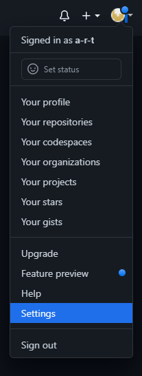
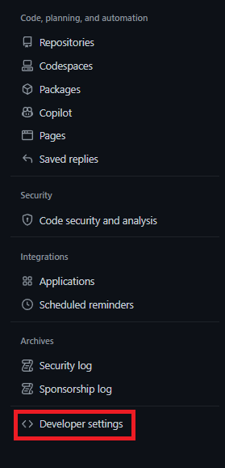
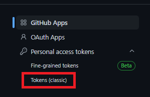
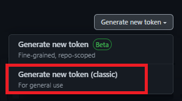
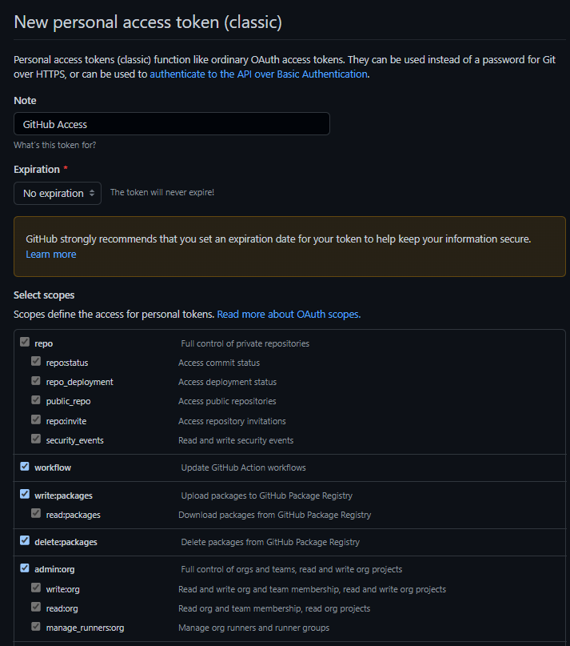
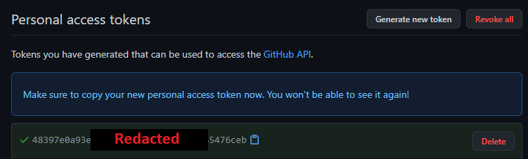

[Home](./)

# GitHub API Access Token Creation Instructions

1\. Go to your account settings.

2\. Select **Developer Settings**.

3\. Select **Personal access tokens**.

4\. Select **Generate new token**.

5\. For **Note** put "GitHub Api Access", and then check off every box before finally hitting **Generate token**.

6\. On this page, you will be given your personal access token (it's in the green box). Copy it and do not lose it, as you will never be able to look it up again. This is what you will use for your GitHub Api password.

