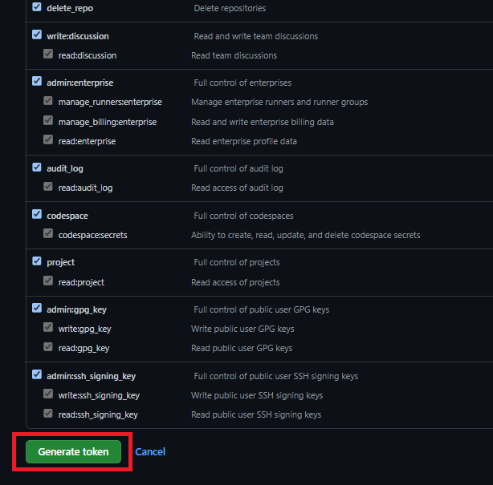

[Home](./)

# GitHub API Access Token Creation Instructions

1\. Go to your account settings.

2\. Select **Developer Settings**.

3\. Select **Personal access tokens**, and hit **Tokens (classic)** from the menu that drops down.

4\. Select **Generate new token**, and hit **Generate new token (classic)** from the menu that drops down.

5\. For **Note** put "GitHub Access". Set the expiration to **No expiration**. Check off every box. When finished filling everything out, hit the **Generate token** button.

6\. On this page, you will be given your personal access token (it's in the green box). Copy it and do not lose it, as you will never be able to look it up again. This is what you will use for your GitHub API password.

